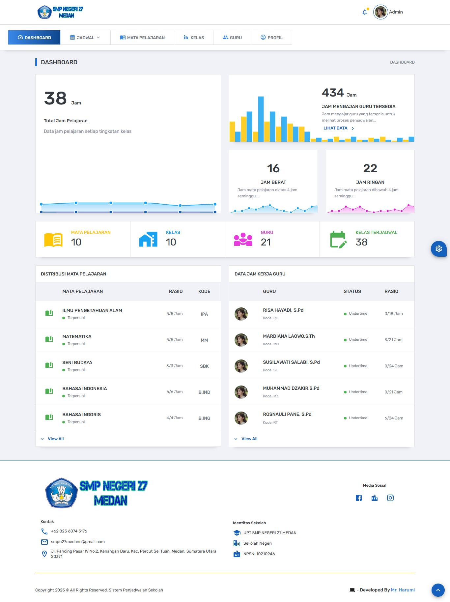
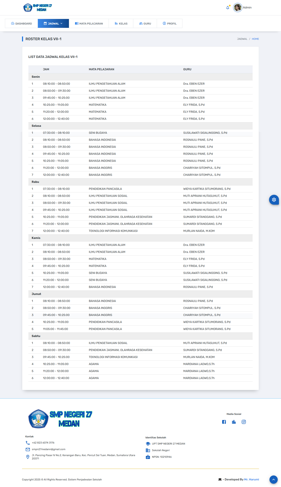

# Sistem Penjadwalan Kegiatan Sekolah

Sistem ini dirancang untuk membantu sekolah dalam menyusun jadwal kegiatan dan pelajaran secara otomatis dan efisien menggunakan metode **Constraint Satisfaction Problem (CSP)**. Sistem ini memastikan jadwal yang dibuat tidak bentrok dan memenuhi aturan yang berlaku di sekolah.

---

## Fitur Utama

- **Manajemen Data Master**  
  Input dan kelola data guru, mata pelajaran, kelas, serta relasinya.

- **Penjadwalan Otomatis**  
  Algoritma CSP yang menjalankan penjadwalan tanpa bentrok dan sesuai aturan.

- **Hard & Soft Constraint**  
  Memenuhi aturan wajib seperti jam pelajaran, guru tidak bentrok, serta distribusi jadwal yang merata.

- **Realtime Progress Update**  
  Menampilkan proses penjadwalan secara real-time menggunakan Server-Sent Events (SSE) dan SweetAlert2.

- **Ekspor Jadwal**  
  Mendukung ekspor hasil jadwal ke format Excel/CSV untuk kemudahan laporan.

- **User-friendly Interface**  
  Dashboard dan tabel interaktif untuk memudahkan manajemen data dan jadwal.

---

## Teknologi yang Digunakan

- Backend: Laravel (PHP Framework)  
- Frontend: React.js / Blade (sesuaikan dengan implementasi)  
- Database: MySQL  
- Real-time Communication: Server-Sent Events (SSE)  
- UI Feedback: SweetAlert2  

---

## Cara Instalasi & Penggunaan

1. **Clone repository**

   ```bash
   git clone https://github.com/satriaharum01/Sistem-Penjadwalan-Kegiatan-Sekolah.git
   cd Sistem-Penjadwalan-Kegiatan-Sekolah
   ```

2. **Install dependencies backend**

   ```bash
   composer install
   ```

3. **Setup environment**

   - Salin file `.env.example` ke `.env`
   - Atur konfigurasi database di `.env`

4. **Migrasi dan seeding database**

   import database dari file .sql yang di repository

5. **Jalankan server Laravel**

   ```bash
   php artisan serve
   ```

6. **Jalankan frontend**

   - Jika ada frontend React, masuk ke folder frontend dan jalankan:

     ```bash
     npm install
     npm run dev
     ```

   - Jika menggunakan Blade, frontend sudah terintegrasi di Laravel.

7. **Akses aplikasi**

   Buka browser dan akses `http://localhost:8000`

---

## Cara Menggunakan

- Masukkan data guru, kelas, dan mata pelajaran lengkap dengan total jam pelajaran.
- Jalankan proses penjadwalan otomatis lewat fitur yang tersedia.
- Pantau proses penjadwalan secara realtime di layar.
- Setelah selesai, lihat jadwal per data kelas.

---

## Kontribusi

Kontribusi sangat kami sambut!  
Silakan fork repo ini dan buat pull request dengan fitur baru atau perbaikan bug.

---

## Lisensi

MIT License © 2025

---

### Screenshot (Kalau ada, bisa ditambahkan disini)




---
